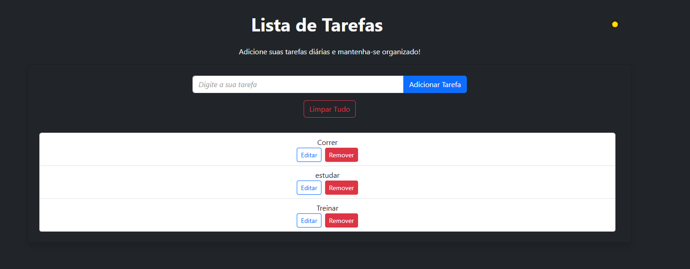

# 📝 Lista de Tarefas

Projeto simples de uma To-Do List feito com HTML, CSS e JavaScript puro. Permite adicionar, editar e remover tarefas com uma interface responsiva e agradável.

## 💡 Funcionalidades

- ✅ Adicionar novas tarefas
- 🖊️ Editar tarefas existentes
- ❌ Remover tarefas
- 💅 Interface moderna com tons de roxo e cinza
- 📱 Responsivo para dispositivos móveis
-  **Persistência de dados com LocalStorage** (as tarefas ficam salvas mesmo ao fechar ou recarregar o navegador)

## 🎨 Layout

- **Cores principais:**  
  - Fundo: `#726560`  
  - Tarefas: `#63426b`  
  - Botões: `#7e57c2` (Editar), `#e57373` (Remover)  
  - Bordas dos botões: brancas

- Estilo minimalista, com destaque nos botões e foco na legibilidade das tarefas.

## 🛠️ Tecnologias

- HTML5  
- CSS3  
- JavaScript (Vanilla)

## 📁 Estrutura de Pastas
/Lista de Tarefas
│
├── index.html

├── style.css

├── script.js

└── screenshot.png


## 🚀 Como usar

1. Clone este repositório:
   ```bash
    git clone https://github.com/natbacx/To-do-List.git 
   ```

 2.  Abra o arquivo index.html no navegador.

Nenhuma dependência externa ou servidor necessário.

📷 Prévia




🤖 
Feito com 💻 e ☕ por Natielle Bacelar.


